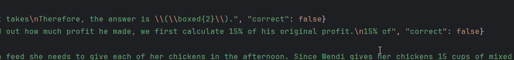

RWKV使用GSM8K数据集来做rollout：测试RWKV模型的数学能力和潜力，rollout可以控制模型在同一个题目上做多少次，只要在多次的测试中对一次，便算RWKV在这题上是正确的，这样可以测的模型潜力；而一道题目只是测一次就可以直观看到RWKV的能力。

本rollout的测试使用BlinkDL/Albatross作为推理框架（https://github.com/BlinkDL/Albatross）
各种参数参考rwkv skills（https://github.com/rwkv-rs/rwkv-skills） 。

使用本系统采用 **Two-Stage Logic (两阶段逻辑)** 采样流程，通过 `argparse` 灵活配置不同阶段的最大长度：
| **Stage 1: Reasoning** | 逻辑推导 | 强制触发 `<think>` 标签，低温度探索路径，确保选择概率最高的Token
| **Stage 2: Answer** | 数值收敛 | 引导 `Therefore, the answer is \(\boxed{`top_k=1确保只选概率最大的那个词，Alpha Presence = 0.0是因为数字经常包含重复位

rwkv作为训练时可并行模型，在推理时它是线性的。可以保持在N（1）复杂度情况下实现SOTA的效果。
在rwkv模型中state就是一个非常重要的特征。
而RWKV的state更新方程：  
新状态 = 衰减系数 × 旧状态 + 输入带来的新信息  
$$\mathbf{S}_t = \mathbf{S}_{t-1} \cdot (\text{diag}(\mathbf{w}_t) + \mathbf{a}_t^\top \mathbf{b}_t) + \mathbf{v}_t^\top \mathbf{k}_t$$
$$\mathbf{S}_t \in \mathbb{R}^{D \times D}$$ : 当前时刻的隐藏状态矩阵（针对单个Head）。  
$$\mathbf{S}_{t-1}$$ : 上一时刻的状态。  
$$\mathbf{w}_t$$ : 动态衰减向量 (Decay)。控制遗忘速度，由输入数据动态生成（Data-dependent），而非固定参数。  
$$\mathbf{k}_t$$ : Key向量。  
$$\mathbf{v}_t$$ : Value向量。  
$$\mathbf{a}_t$$ : 学习率/锚点向量 (In-context Learning Rate)。这是v7的核心引入变量，控制对当前Key的更新强度，使模型能执行“差分更新”。

数据集使用了 https://raw.githubusercontent.com/openai/grade-school-math/master/grade_school_math/data/test.jsonl 中的 openai 开源 GSM8K 测试集，一共 1319 条测试数据。

原始数据格式：

```json
{"question": "A robe takes 2 bolts of ···", "answer": "It takes ··· of fabric\n#### 3"}
{"question": "James decides ··· week?", "answer": "He sprints ··· meters\n#### 540"}
```
首先我的项目会检查是不是在指定文件 eval 夹中存在 gsm8k_test.jsonl 测试文件，没有会自动下载。

完成下载之后，并不是直接喂给模型，而是在读取之前的时候使用一些规则先：

```python
text = str(raw).replace(",", "")
match = re.search(r"[-+]?[0-9]*\.?[0-9]+", text)
return match.group(0) if match else text.strip()
```

完成文本的更新，避免出现格式的问题，例如将 1,000 变成 1000，方便计算机识别。

确认格式没有问题之后，使用 `prompts = [f"User: {x['q']}\n\nAssistant: <think" for x in batch_samples]` 实现 rwkv 标准的提示词形式。完成提示之后，开始利用 reference 文件中的分词器和词表，将输入全部编写：

```python
prompt_tokens = [[0] + tokenizer.encode(p) for p in prompts]
```

我正是利用了 state 完成的 prifill，将模型读取完题目之后，直接“暂停”模型，将当前 state 保存起来，作为 state_snapshot_q。

```python
state_snapshot_q = [x.clone() for x in state_raw]
out_snapshot_q = out_raw.clone()
```

保存之后接着完成运行，模型便开始根据这个 state 完成推理，这个长度是被我们的 cot_max_len 所控制的，是我们需要给出的命令（一般设计成 512）。
实现的做多次推理的时候会使用 `seen_start_tokens = [set() for _ in range(bsz)]` 完成记录每个样本已使用的起始 Token，使用：

```python
if step_idx == 0 and attempt > 0:
    for i in range(bsz):
        if not got_correct[i]:  # 没做对的才需要强制换路
            for ban_id in seen_start_tokens[i]:
                out_curr[i, ban_id] = -float('inf')
# [NEW] Logic: 记录这一轮选择的起始路
if step_idx == 0:
    tokens_cpu_check = tokens.cpu().view(-1).tolist()
    for i in range(bsz):
        seen_start_tokens[i].add(tokens_cpu_check[i])
```

确保模型在尝试不同的解法，但是 tem 在 cot 为 0.3 的情况下，可以使得 rwkv 选择确定度最高的哪一个，确保模型真实探寻，而不是胡言乱语。

```python
if pred and gold and float(pred) == float(gold):
    got_correct[i] = True
    best_gen_text[i] = full_text
    # 打印一下做对的信息，看看是第几次 Attempt 成功的
    print(f"HIT! Q: {batch_samples[i]['q'][:20]}... | Attempt: {attempt + 1}")

if attempt == 0 or got_correct[i]:
    best_gen_text[i] = full_text
```

会将每一个问题都是展开的，都可以直接在终端中找到答案。
在完成推理之后，使用：

```python
transition_text = "\nTherefore, the answer is \\(\\boxed{"
transition_ids = tokenizer.encode(transition_text)
out_curr = model.forward_batch(transition_batch, state_curr)

if transition_text in full_text:
    ans_part = full_text.split(transition_text)[-1]
transition_batch = [transition_ids for _ in range(bsz)]
```

确保模型在输出答案的时候一定是会出现 Therefore, the answer is \\(\\boxed{ 来存放答案，（测试完毕的会放在 out 文件夹中，如果没有，则会自动创建）。从而实现检测模型输出的 answer 简单化，会保留模型的思考过程，从而可以更好的使用大模型帮助我们快速检查。
使用out_curr强行输入这串 Token，强制将模型的隐层状态（Hidden State）扭转到“我要输出答案了”的模式。

```text
{"q": "A robe takes 2 bolts of blue fiber and half that much white fiber.  How many bolts in total does it take?"···
Therefore, the answer is \\(\\boxed{2}\\)."，“answer：3” "correct": false}
```
在数据提取的时候会使用正则捕获，在确认答案的时候会使用这个，确保数值正确就好，不在乎格式。
```python
if pred and gold and float(pred) == float(gold):
    got_correct[i] = True
```
运行时的终端会出现这样的内容提示当前是模型第几次做当前的题目。
在测评之后的数据中会存在这样几个数据，问题q，答案a，思考<think></think>，是否正确correct
 ```python           
            if args_cli.output:
                saved_rows.append({
                    "q": batch_samples[i]['q'],
                    "a": batch_samples[i]['a'],
                    "gen": best_gen_text[i],
                    "correct": got_correct[i]
                })
```
保存的测试内容尾部如下

示例
```text
{"q": "Kylar went to the store to buy glasses for his new apartment. One glass costs $5, but every second glass costs only 60% of the price. Kylar wants to buy 16 glasses. How much does he need to pay for them?", "a": "64", "gen": ">Okay, let's see. Kylar is buying glasses for his apartment. The problem says he wants to buy 16 glasses. Each glass costs $5, but every second glass costs only 60% of the price. We need to find out how much he needs to pay for 16 glasses.\nFirst, I need to figure out how much each glass costs. Since each glass is $5, and there are 16 glasses, the total cost would be 16 times $5. Let me calculate that: 16 times 5 is 80. So, each glass costs $80.\nNow, Kylar wants to buy 16 glasses. To find out how much he needs to pay for 16 glasses, I can divide the total cost by the number of glasses he wants. That would be 80 divided by 16. Let me do that calculation: 80 divided by 16 equals 5. So, each glass costs $5.\nWait a second, let me double-check that. If each glass costs $5, then 16 times 5 is 80. Yep, that seems right. So the answer should be $5 per glass.\nBut just to make sure I didn't make any mistakes in my calculations. Let me go through it again step by step to confirm.\nFirst, total cost: 16 times $5 is 80. That's correct because each glass costs $5, so 16 times 5 is 80.\nThen, each glass costs $80 divided by 16. Let's do that division: 80 divided by 16 is 5. So each glass costs $5 per glass.\nYes, that seems right. I think that's the answer.</think>Kylar needs to pay for 16 glasses of his new apartment. Each glass costs $5, and he wants to buy 16 glasses. \n**Step-by-Step Explanation:**\n1. **Calculate the total cost of the glasses:**  \n   Each glass costs $5, so the total cost is:  \n   \\[\n   16 \\text{ glasses} \\times \\$5/\\text{glass} = \\$80\n   \\]\n2. **Determine how many glasses Kylar needs to buy:**  \n   Kylar wants to buy 16 glasses. To find out how many glasses he needs to pay for, divide the total cost by the number of glasses:  \n   \\[\n   \\frac{\\$80}{\\$16} = 5\n   \\]\n**Answer:** Kylar needs to pay for 16 glasses.\nTherefore, the answer is \\(\\boxed{5}\\).", "correct": false}
```
对于当前测试RWKV的参数如下：

| 参数项 | Stage 1 (CoT) | Stage 2 (Final) | 针对 RWKV 的设计意图                                   |
| :--- | :--- | :--- |:------------------------------------------------|
| Temperature | `0.3` | `0.8` | CoT: 低温保证选择概率最高；Final: 属于“标准问答”建议值。 |
| Top_P | `0.3` | `0.3` | 截断概率分布尾部，剔除噪声 Token。                            |
| Top_K | `50` | `1 (Greedy)` | Final 阶段强制强制收敛，确保数值格式绝对确定。                  |
| Alpha Presence | `0.5` | `0.0` | CoT: 强惩罚复读；Final: 允许数字自然出现。         |
| Alpha Decay | `0.99` | `0.99` | 核心参数：控制 RNN 状态随 Token 推进的衰减，维持长期记忆。         |

当前项目使用显卡是 5070ti，sm120 架构，请根据您的显卡更改 torch 的下载脚本：

```bash
uv pip install --pre torch torchvision torchaudio --index-url https://download.pytorch.org/whl/nightly/cu128
uv pip install -r requirements.txt
```

运行命令：

```bash
python gsm8k_rollout.py \
  --model "path" \
  --batch 8 \
  --cot_max_len 512 \
  --final_max_len 64 \
  --passes 1 \
  --output "out/gsm8k_0p1b.jsonl"
